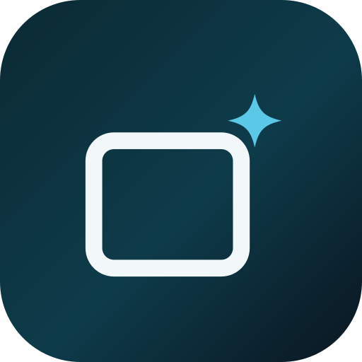
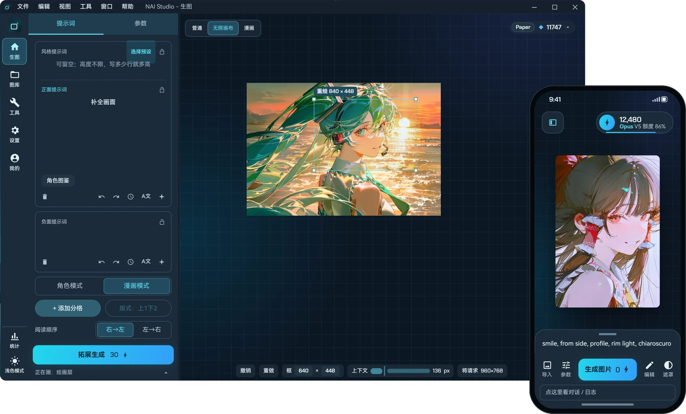
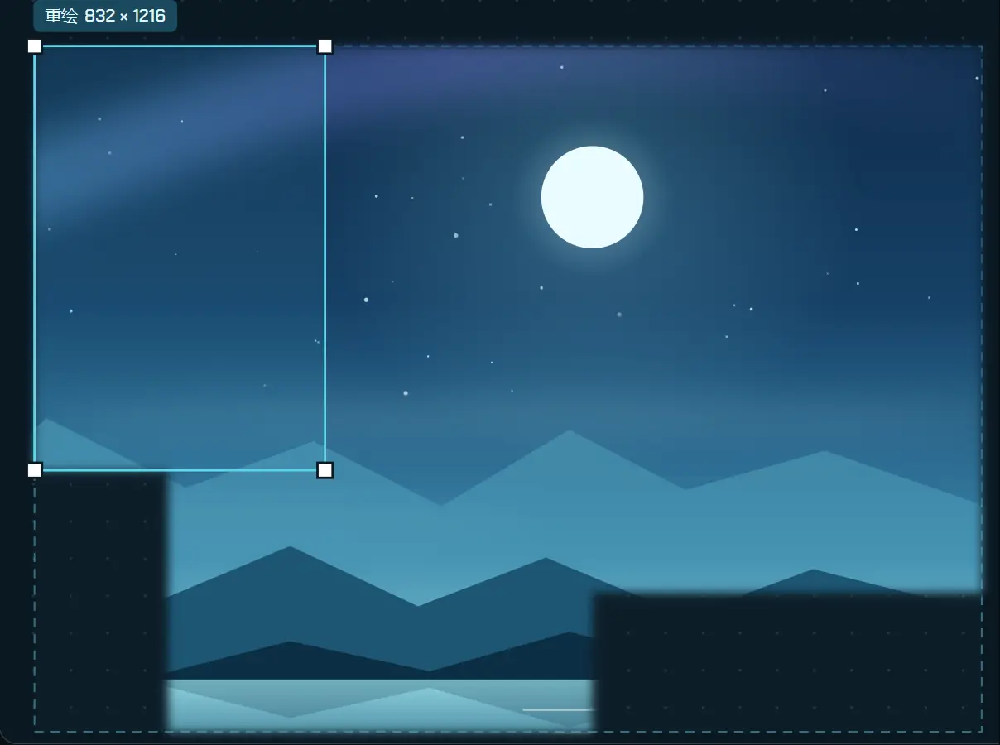
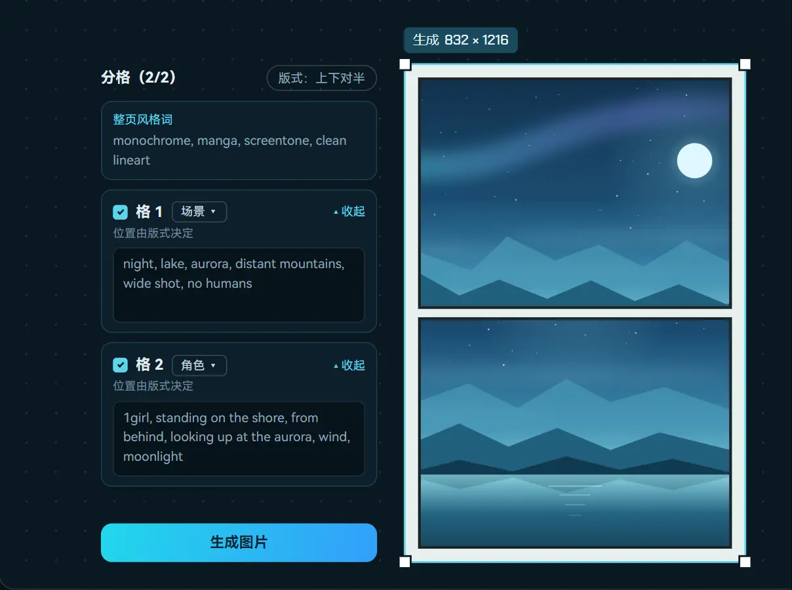
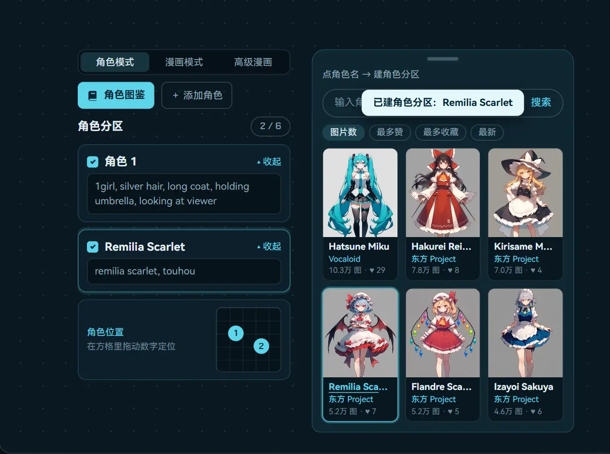
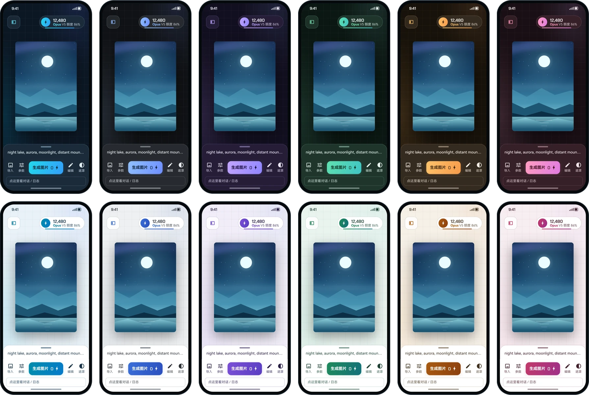

<h1 align="center">
  &nbsp;NAI Studio
</h1>

<p align="center">
  <b>NovelAI 原生客户端，电脑和手机用同一套界面。</b><br>
  易用、便捷、快速：文生图、局部重绘、无限画布、漫画分镜，都在一个画面里完成。
</p>

<p align="center">
  <a href="https://github.com/ka114n/NAI-Studio/releases/latest"></a>
  
  
  
  <a href="LICENSE"></a>
</p>

<p align="center">
  <a href="https://github.com/ka114n/NAI-Studio/releases/latest">下载</a> ·
  <a href="https://naistudio.art">官网</a> ·
  <a href="#功能">功能</a> ·
  <a href="#构建">构建</a>
</p>

<p align="center">
  
</p>

> 本项目独立维护，并非 NovelAI 官方产品，与 Anlatan 没有关联。需要自备 NovelAI 账号的 Persistent API Token，或自托管网关地址。

## 功能

### 框一下，画面就长出来 · 无限画布

在已有画面旁边框一块区域，点「拓展生成」，新内容接着原图往外长。接缝自动羽化，框多大都行，会自动换算成合适的请求尺寸；参考多宽的周边画面也可以调。

<p align="center"></p>

### 一格一格写，一整页生成 · 漫画模式

每一格单独写提示词，标注场景、角色、台词或道具；可以选版式和阅读顺序（右→左或左→右），整页风格词统一管理。

<p align="center"></p>

### 点一下角色，分区就建好 · 角色模式

在「角色模式」里打开角色图鉴，点角色名就自动新建一个角色分区，提示词已经填好。每个角色单独写描述，在方格里拖动数字定位。V4 / V4.5 最多 6 个分区，V5 最多 32 个。

<p align="center"></p>

### 换个颜色，更合心意 · 配色与语言

内置 6 套配色，每套分深色和浅色，也可以自己调色。电脑版和手机版同步。界面支持简体中文和英文。

<p align="center"></p>

### 还有这些

| 功能 | 说明 |
| --- | --- |
| 文生图、图生图、局部重绘 | 支持 NAI V4、V4.5、V5 全部模型。局部重绘在内置画布编辑器里直接涂遮罩，画笔、橡皮、套索、吸管都有。 |
| 提示词工具 | 用 Tag Codex 查标签，用 AnimaDex 查画师风格，内置翻译；常用风格提示词可以从预设里一键选。 |
| 图库 | 按时间或随机排列，支持分组。生成参数读写在 PNG 元数据里，改过的参数可以一键重置。 |
| 用量统计 | 像 GitHub 贡献图一样按月查看每天生成了多少张，电脑和手机显示一致。 |
| 两种接入方式 | 填 NovelAI 的 Persistent API Token 直连官方，或填自托管网关地址，随时切换。 |
| 桌面小组件（仅 Android） | 1×2 余额条，或 3×2 的余额、统计和日历，不打开 App 也能看到。 |

> 本页图片为界面演示画面，配色数值取自 App 主题。

## 下载

在 [Releases](https://github.com/ka114n/NAI-Studio/releases) 下载。

- Windows：解压 ZIP，打开 `NAI Studio.exe`，保留同目录的 `app` 和 `runtime`，无需安装 Java。
- Android：安装 APK，要求 Android 8.0 或更高。如果旧测试版签名冲突，请先导出备份，再卸载测试版后安装。

Windows 网页笔刷首次使用会下载 Chromium 运行组件。翻译词典与索引首次启动在后台准备，需要网络；之后使用本机缓存。

## 源码结构

- `desktop/naistudio-desktop`：Windows 平台应用。
- `desktop/naistudio-shared`：桌面界面、状态、模型和服务。
- `phone/naistudio`：Android 应用。
- `phone/naistudio-shared`：手机界面、模型和服务。

两端保留独立源码副本，跨端修改需同步检查。

## 构建

使用 JDK 17，首次构建需要联网下载 Gradle 依赖。

Windows，在 `desktop/naistudio-desktop` 执行：

```powershell
..\gradlew.bat test desktopInput --no-daemon
```

`desktopInput` 收集应用和依赖 JAR 到 `build/jpackage-input`。可使用 JDK 的 `jpackage --type app-image` 制作便携版，主类为 `com.kallan.naistudio.desktop.MainKt`。发布时将 `docs/brush-lab*.html` 放入应用的 `app` 目录。

Android，安装 SDK，在 `phone/naistudio/local.properties` 配置 `sdk.dir`，然后在 `phone/naistudio` 执行：

```powershell
.\gradlew.bat :app:testLocalDebugUnitTest :app:assembleLocalRelease --no-daemon
```

Release APK 默认未签名，使用自己的密钥签名。构建会递增版本迭代文件，本次发布版本为 1.1.140。

## 数据与默认规则

新安装的风格预设列表、正负面提示词及历史示例上下文为空。保留翻译、优化、反推和漫画分镜的功能规则，以及模型画质词和负面预设。标签数据和可选外部词典可能包含成人词汇，词典与 AI 功能规则是不同内容。

用户配置的服务会接收相关提示词或图像。仓库不含个人凭据、设置、生成历史及签名私钥，请勿提交这些文件。

## 许可

项目自有代码采用 [MIT](LICENSE)。第三方依赖、数据和素材的条款不由 MIT 覆盖，见 [THIRD_PARTY_NOTICES.md](THIRD_PARTY_NOTICES.md)。
